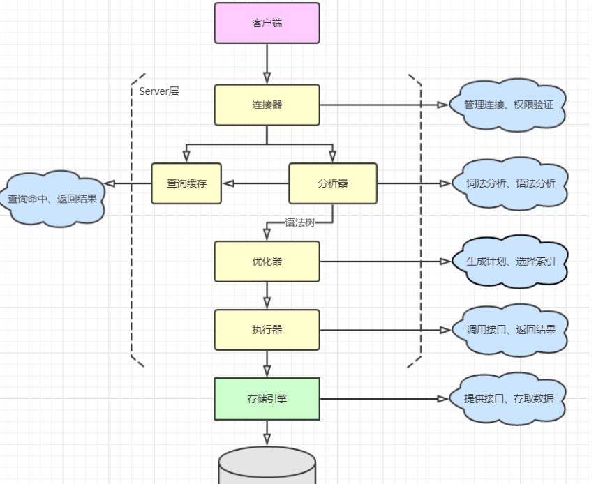

# 索引

## 聚簇索引

## 非聚簇索引

## 覆盖索引 
covering index
> 如果一个索引包含 (或者覆盖) 所有需要查询的字段值，我们就称之为“覆盖索引”。  
> 即：从非主键索引中就能所需数据列，无需回表查询，减少树的IO搜索次数，速度更快。  

如：select id,name from table where name='';  
其中id为主键，name为唯一索引

### 优点
* 索引大小远小于数据行大小。因而，如果只读取索引，则能极大减少对数据访问量
* 索引都按值得大小存储，相对于随机访问记录，需要更少的I/O
* 数据引擎能更好的缓存索引，比如MyISAM只缓存索引
* 覆盖索引对InnoDB尤其有用，因为InnoDB使用聚集索引组织数据，如果二级索引包含查询所需的数据，就不再需要在聚集索引中查找了

### 限制
* 覆盖索引也并不适用于任意的索引类型，索引必须存储列的值
* Hash和full-text索引不存储值，因此MySQL只能使用BTree
* 不同的存储引擎实现覆盖索引都是不同的，并不是所有的存储引擎都支持覆盖索引
* 如果要使用覆盖索引，一定要注意SELECT列表值取出需要的列，不可以SELECT * ，因为如果将所有字段一起做索引会导致索引文件过大，查询性能下降

### 使用
> 如何确定数据库成功使用了覆盖索引呢  
在explain的extra列可以看到using index的信息，说明使用了覆盖索引

## Hash索引

## 索引合并
MySQL在 5.0版本中引入新特性：索引合并优化(Index merge optimization)，当查询中单张表可以使用多个索引时，同时扫描多个索引并将扫描结果进行合并。  
> 通俗解释就是: 一条SQL中使用两个或多个索引,查出来的数据集取交集或并集

### 主要适用于以下场景
- 对 or 语句求并集  
如查询```select * from user where name='xxx' or age=xx```时，如果 name 和 age 列上分别有索引，可以按照 name 和 age 条件进行查询，再将查询结果合并（union）操作，得到最终结果

- 对 and 语句求交集  
如查询```select * from user where name='xxx' and age=xx```时，如果 name 和 age 列上分别有索引，可以按照 name 和 age 条件进行查询，再将查询结果取交集（intersect）操作，得到最终结果

- 对 and 和 or组合语句求结果
```select * from user where name = “leo” and age > 20 or score > 100;```  
user表中包含索引 age、索引 score
此时，使用合并索引不会提高效率  
当索引 age 查出来数据为1000W条, 索引 score 查出来的数据只有1000条,当两个数据集取交集时,这种情况很消耗IO的  
遇到这种情况可以尝试优化SQL来实现(union)
```sql
select * from user where name='leo' and age > 20 
union all 
select * from user where name='leo' and score > 100 and age <= 20;
```
**注意: 第二条sql中要包含第一条sql中的反操作,避免数据重复。**

## 索引下推 ICP
> Index Condition Pushdown 简称ICP。在MySQL5.6推出。用于减少回表次数，优化查询  


> 不使用ICP的情况:  
> 使用 **普通索引** (非聚簇索引)查询时，存储引擎通过索引检索到数据，然后将数据返回值MySQL服务器，由服务器判断数据是否符合条件

> 使用ICP的情况:  
> 如果查询条件中含有 **普通索引的列**，MySQL服务器将这部分判断条件向下传递至存储引擎，**由存储引擎通过判断索引是否符合MySQL服务器传递的条件**，只有当索引符合条件时才将数据检索出返回给MySQL服务器。

>索引下推，可以减少回表查询次数

### 举个栗子
假设有一张用户表t_user，联合索引(name,age)，如下:  
| ID |   NAME   | AGE |
|:--:|:--------:|:---:|
|  1 |   任某    | 20  |
| 2  |   任某    | 30  |
| 3  |   王某    | 40  |

#### 查询条件1  
执行查询
```sql
select * from t_user where name like '任%'
```  
根据 "最佳左前缀" 的原则，这里使用了联合索引（name，age）进行了查询，性能要比全表扫描肯定要高

#### 查询条件2
执行查询
```sql
select * from t_user where name like '任%' and age=30
```  
- MySQL 5.6 之前  
  因5.6之前版本没有ICP，因此查询时存储引擎通过联合索引找到name like '任%' 的主键id（1、2），逐一进行回表扫描，去聚簇索引找到完整的行记录，server层再对数据根据age=30进行筛选 
- MySQL 5.6 之后  
  在5.6 以后，存储引擎根据（name，age）联合索引，找到name like '任%'，由于联合索引中包含age列，所以存储引擎直接再联合索引里按照age=30过滤。按照过滤后的数据再一一进行回表扫描，将完整的行记录返回至Server  
  可以看到只回表了一次  

### 使用条件
* 只能用于range、 ref、 eq_ref、ref_or_null访问方法(执行计划type)
* 只能用于InnoDB和 MyISAM存储引擎及其分区表
* 对InnoDB存储引擎来说，索引下推只适用于普通索引(非聚簇索引)
* 引用了子查询的条件不能下推
* 引用了存储函数的条件不能下推，因为存储引擎无法调用存储函数

## 索引失效