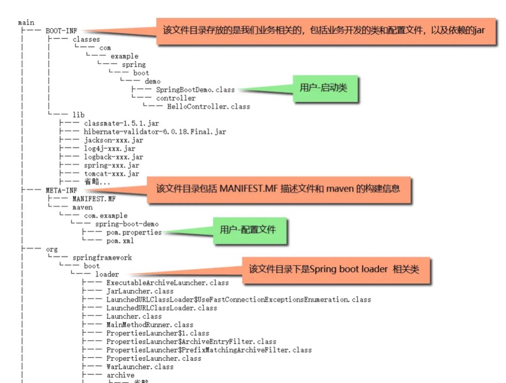

# Spring Boot Jar 启动过程
Spring boot Jar 俗称 Fat Jar

## Executable Jar文件结构


## MANIFEST.MF 文件内容
```xml
Manifest-Version: 1.0
Implementation-Title: demo
Implementation-Version: 1.0.0-SNAPSHOT
Archiver-Version: Plexus Archiver
Built-By: oneday
Implementation-Vendor-Id: com.example
Spring-Boot-Version: 2.1.3.RELEASE
Main-Class: org.springframework.boot.loader.JarLauncher
Start-Class: com.example.demo.SpringBootLauncherDemo
Spring-Boot-Classes: BOOT-INF/classes/
Spring-Boot-Lib: BOOT-INF/lib/
Created-By: Apache Maven 3.3.9
Build-Jdk: 1.8.0_171
```

## spring-boot-maven-plugin 打包过程
我们明明没有添加org.springframework.boot.loader下的这些类，那么它们是如何被打包在 FatJar 里面的呢？就是它, spring-boot-maven-plugin 

当我们执行package命令的时候会看到下面这样的日志：
```bash
[INFO] --- spring-boot-maven-plugin:2.2.5.RELEASE: repackage (repackage) @ spring-boot-demo ---
[INFO] Replacing main artifact with repackaged archive
```
repackage目标将执行org.springframework.boot.maven.RepackageMojo#execute，该方法的主要是调用了org.springframework.boot.maven.RepackageMojo#repackage
```java
//RepackageMojo.java
private void repackage() throws MojoExecutionException {
    
    //获取maven-jar-plugin生成的jar,并最终将该jar的命名将加上.orignal后缀
    Artifact source = getSourceArtifact();
    
    //最终文件，即Fat jar
    File target = getTargetFile();
    
    //获取重新打包器，将重新打包成可执行jar文件
    Repackager repackager = getRepackager(source.getFile());  

    //查找并过滤lib库依赖，即pom中定义的dependency
    Set<Artifact> artifacts = filterDependencies(this.project.getArtifacts(), getFilters(getAdditionalFilters()));
    
    //将artifacts转换成libraries
    Libraries libraries = new ArtifactsLibraries(artifacts, this.requiresUnpack, getLog());
    
    try {
        //提供Spring Boot启动脚本
        LaunchScript launchScript = getLaunchScript();
        
        //执行重新打包逻辑，生成最后fat jar
        repackager.repackage(target, libraries, launchScript);
    }catch (IOException ex) {
        throw new MojoExecutionException(ex.getMessage(), ex);
    }

    //将source更新成 xxx.jar.orignal文件
    updateArtifact(source, target, repackager.getBackupFile());
}

private Repackager getRepackager(File source) {
    Repackager repackager = new Repackager(source, this.layoutFactory);

    repackager.addMainClassTimeoutWarningListener(new LoggingMainClassTimeoutWarningListener());
    
    //设置main class的名称，如果不指定的话则会查找第一个包含main方法的类，
    //repacke最后将会设置org.springframework.boot.loader.JarLauncher
    repackager.setMainClass(this.mainClass);
    
    if (this.layout != null) {
        getLog().info("Layout: " + this.layout);
        repackager.setLayout(this.layout.layout());
    }
    return repackager;
}
```
repackager设置了 layout方法的返回对象，也就是org.springframework.boot.loader.tools.Layouts.Jar
```java
/**
 * Executable JAR layout.
 */
public static class Jar implements RepackagingLayout {

    @Override
    public String getLauncherClassName() {
        return "org.springframework.boot.loader.JarLauncher";
    }

    @Override
    public String getLibraryDestination(String libraryName, LibraryScope scope) {
        return "BOOT-INF/lib/";
    }

    @Override
    public String getClassesLocation() {
        return "";
    }

    @Override
    public String getRepackagedClassesLocation() {
        return "BOOT-INF/classes/";
    }

    @Override
    public boolean isExecutable() {
        return true;
    }

}
```
文件布局**layout**，看到定义在 MANIFEST.MF 文件的 Main-Class 属性org.springframework.boot.loader.JarLauncher，接下来重点看下JarLauncher

## JarLauncher构造过程
因为org.springframework.boot.loader.JarLauncher的类是在spring-boot-loader中的
但是若想在IDEA中来看源码，需要在pom文件中引入如下配置
```xml
<dependency>
    <groupId>org.springframework.boot</groupId>
    <artifactId>spring-boot-loader</artifactId>
    <scope>provided</scope>
</dependency>
```

找到org.springframework.boot.loader.JarLauncher类

```java
public class JarLauncher extends ExecutableArchiveLauncher {
    // BOOT-INF/classes/
    static final String BOOT_INF_CLASSES = "BOOT-INF/classes/";
    // BOOT-INF/lib/
    static final String BOOT_INF_LIB = "BOOT-INF/lib/";

    public JarLauncher() {
    }

    protected JarLauncher(Archive archive) {
        super(archive);
    }

    @Override
    protected boolean isNestedArchive(Archive.Entry entry) {
        if (entry.isDirectory()) {
            return entry.getName().equals(BOOT_INF_CLASSES);
        }
        return entry.getName().startsWith(BOOT_INF_LIB);
    }

    public static void main(String[] args) throws Exception {
        new JarLauncher().launch(args);
    }
}
```

可以发现，JarLauncher定义了BOOT_INF_CLASSES和BOOT_INF_LIB两个常量，正好就是前面我们解压之后的两个文件目录。JarLauncher包含了一个main方法，作为应用的启动入口

从 main 来看，只是构造了一个 JarLauncher对象，然后执行其 launch 方法，然看其父类ExecutableArchiveLauncher构造方法

```java
// ExecutableArchiveLauncher.java
public ExecutableArchiveLauncher() {
    try {
        this.archive = createArchive();
    }
    catch (Exception ex) {
        throw new IllegalStateException(ex);
    }
}

protected final Archive createArchive() throws Exception {
    ProtectionDomain protectionDomain = getClass().getProtectionDomain();
    CodeSource codeSource = protectionDomain.getCodeSource();
    URI location = (codeSource != null) ? codeSource.getLocation().toURI() : null;
    // 这里就是拿到当前的 classpath 的绝对路径
    String path = (location != null) ? location.getSchemeSpecificPart() : null;
    if (path == null) {
        throw new IllegalStateException("Unable to determine code source archive");
    }
    File root = new File(path);
    if (!root.exists()) {
        throw new IllegalStateException("Unable to determine code source archive from " + root);
    }
    // 将构造的archive 对象返回
    return (root.isDirectory() ? new ExplodedArchive(root) : new JarFileArchive(root));
}
```

### Archive
> Archive相关的概念
>* archive即归档文件，这个概念在linux下比较常见
>* 通常就是一个tar/zip格式的压缩包
>* jar是zip格式
```java
public abstract class Archive {
    public abstract URL getUrl();
    public String getMainClass();
    public abstract Collection<Entry> getEntries();
    public abstract List<Archive> getNestedArchives(EntryFilter filter);
}
```

Archive是在spring boot里抽象出来的用来统一访问资源的接口。该接口有两个实现，分别是ExplodedArchive和JarFileArchive。前者是一个文件目录，后者是一个jar，都是用来在文件目录和jar中寻找资源的，这里看到JarLauncher既支持jar启动，也支持文件系统启动，实际上我们在解压后的文件目录里执行 java org.springframework.boot.loader.JarLauncher 命令也是可以正常启动的。  
在FatJar中，使用的是后者

Archive类还有一个getNestedArchives方法，下面还会用到这个方法，这个方法实际返回的是springboot-demo.jar/lib下面的jar的Archive列表。
> 它们的URL是：
>* jar:file:/Home/root/spring-boot-demo/target/springboot-demo.jar!/BOOT-INF/lib/spring-boot-starter-web-2.2.5.RELEASE.jar!  
>* jar:file:/Home/root/spring-boot-demo/target/springboot-demo.jar!/BOOT-INF/lib/spring-boot-starter-2.2.5.RELEASE.jar!
>* jar:file:/Home/root/spring-boot-demo/target/springboot-demo.jar!/BOOT-INF/lib/spring-boot-2.2.5.RELEASE.jar!
>* jar:file:/Home/root/spring-boot-demo/target/springboot-demo.jar!/BOOT-INF/lib/spring-boot-autoconfigure-2.2.5.RELEASE.jar!/

### launch()执行流程
```java
// Launcher.java
protected void launch(String[] args) throws Exception {
    /*
     * 利用 java.net.URLStreamHandler 的扩展机制注册了SpringBoot的自定义的可以解析嵌套jar的协议。
     * 因为SpringBoot FatJar除包含传统Java Jar中的资源外还包含依赖的第三方Jar文件
     * 当SpringBoot FatJar被java -jar命令引导时，其内部的Jar文件是无法被JDK的默认实现
     * sun.net.www.protocol.jar.Handler当做classpath的，这就是SpringBoot的自定义协议的原因。
    */
    JarFile.registerUrlProtocolHandler();
    //通过 classpath 来构建一个 ClassLoader
    ClassLoader classLoader = createClassLoader(getClassPathArchives());
    launch(args, getMainClass(), classLoader);
}
```
重点关注下createClassLoader(getClassPathArchives()) 构建ClassLoader的逻辑，首先调用getClassPathArchives()方法返回值作为参数，该方法为抽象方法，具体实现在子类ExecutableArchiveLauncher中：

```java
// ExecutableArchiveLauncher.java
@Override
protected List<Archive> getClassPathArchives() throws Exception {
    List<Archive> archives = new ArrayList<>(this.archive.getNestedArchives(this::isNestedArchive));
    postProcessClassPathArchives(archives);
    return archives;
}
```
该方法会执行Archive接口定义的getNestedArchives方法返回的与指定过滤器匹配的条目的嵌套存档列表。从上文可以发现，这里的archive其实就是JarFileArchive ，传入的过滤器是JarLauncher#isNestedArchive方法引用

```java
// JarLauncher.java
@Override
protected boolean isNestedArchive(Archive.Entry entry) {
    // entry是文件目录时，必须是我们自己的业务类所在的目录 BOOT-INF/classes/
    if (entry.isDirectory()) {
        return entry.getName().equals(BOOT_INF_CLASSES);
    }
    // entry是Jar文件时，需要在依赖的文件目录 BOOT-INF/lib/下面
    return entry.getName().startsWith(BOOT_INF_LIB);
}
```

getClassPathArchives方法通过过滤器将BOOT-INF/classes/和BOOT-INF/lib/下的嵌套存档作为List<Archive>返回参数传入createClassLoader方法中。

```java
// Launcher.java
protected ClassLoader createClassLoader(List<Archive> archives) throws Exception {
    List<URL> urls = new ArrayList<>(archives.size());
    for (Archive archive : archives) {
        //前面说到，archive有一个自己的URL的，获得archive的URL放到list中
        urls.add(archive.getUrl());
    }
    //调用下面的重载方法
    return createClassLoader(urls.toArray(new URL[0]));
}

protected ClassLoader createClassLoader(URL[] urls) throws Exception {
    return new LaunchedURLClassLoader(urls, getClass().getClassLoader());
}
```

createClassLoader()方法目的是为得到的URL们创建一个类加载器 LaunchedURLClassLoader，构造时传入了当前Launcher的类加载器作为其父加载器，通常是系统类加载器。  

看LaunchedURLClassLoader的构造过程：
```java
//LaunchedURLClassLoader.java
public LaunchedURLClassLoader(URL[] urls, ClassLoader parent) {
    super(urls, parent);
}
```

LaunchedURLClassLoader是spring boot自己定义的类加载器，继承了JDK的URLClassLoader并重写了loadClass方法，也就是说它修改了默认的类加载方式，定义了自己的类加载规则，可以从前面得到的 List<Archive>中加载依赖包的class文件了。  
LaunchedURLClassLoader创建完成后，我们回到Launcher中，下一步就是执行launch的重载方法了。
```java
// Launcher.java
launch(args, getMainClass(), classLoader);
```
在此之前，会调用getMainClass方法并将其返回值作为参数。

getMainClass的实现在Launcher的子类ExecutableArchiveLauncher中：
```java
// ExecutableArchiveLauncher.java
@Override
protected String getMainClass() throws Exception {
    //从 archive 中拿到 Manifest文件
    Manifest manifest = this.archive.getManifest();
    String mainClass = null;
    if (manifest != null) {
        //就是MANIFEST.MF 文件中定义的Start-Class属性，也就是我们自己写的com.example.demo.SpringBootLauncherDemo这个类
        mainClass = manifest.getMainAttributes().getValue("Start-Class");
    }
    if (mainClass == null) {
        throw new IllegalStateException("No 'Start-Class' manifest entry specified in " + this);
    }
    //返回mainClass
    return mainClass;
}
```
得到mainClass后，执行launch的重载方法：
```java
// Launcher.java
protected void launch(String[] args, String mainClass, ClassLoader classLoader) throws Exception {
    // 将自定义的LaunchedURLClassLoader设置为当前线程上下文类加载器
    Thread.currentThread().setContextClassLoader(classLoader);
    // 构建一个 MainMethodRunner 实例对象来启动应用
    createMainMethodRunner(mainClass, args, classLoader).run();
}

// Launcher.java
protected MainMethodRunner createMainMethodRunner(String mainClass, String[] args, ClassLoader classLoader) {
    return new MainMethodRunner(mainClass, args);
}
```
MainMethodRunner对象构建完成后，调用它的run方法：
```java
//MainMethodRunner.java
public void run() throws Exception {
    //使用当前线程上下文类加载器也就是自定义的LaunchedURLClassLoader来加载我们自己写的com.example.spring.boot.demo.SpringBootLauncherDemo这个类
    Class<?> mainClass = Thread.currentThread().getContextClassLoader().loadClass(this.mainClassName);
    //找到SpringBootDemo的main方法
    Method mainMethod = mainClass.getDeclaredMethod("main", String[].class);
    //最后，通过反射的方式调用main方法
    mainMethod.invoke(null, new Object[] { this.args });
}
```
至此，我们自己的main方法开始被调用，所有我们自己的应用程序类文件均可通过/BOOT-INF/classes加载，所有依赖的第三方jar均可通过/BOOT-INF/lib加载，然后就开始了spring boot的启动流程了。